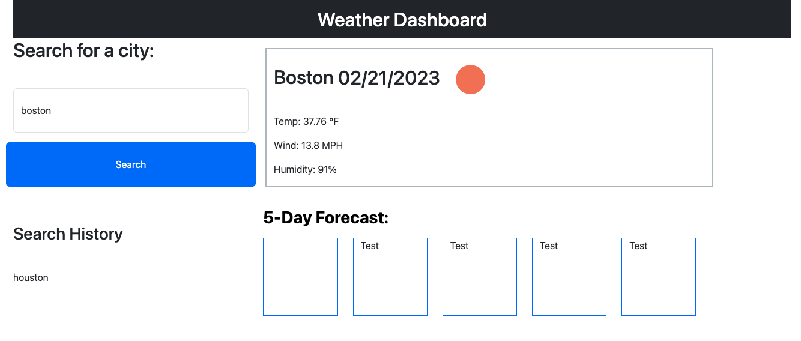

# Weather Dashboard

## Description

This webpage was an exercise in APIs, bootstrap, and JavaScript, once again. The motivation behind this project was to work with these three aspects of coding to harmoniously create a user-friendly weather dashboard, using data collected by a third-party API. I build this project to exercise my JavaScript skills and further my understanding of APIs.

This app solves the problem of needing a convenient and reliable place to search for weather. This app allows you to see current and future weather patterns, and saves past searches, while not cluttering your screen with too many options. 

Throughout this project, I learned how to connect an API to my files, harness the data within an API to use in my project, utilize bootstrap as a convenient formatting tool, and finally use JavaScript to bring everything together.

[Weather-Dashboard](https://lparr30.github.io/weather-dashboard/)

## Usage

To use this application, enter the name of the city for which you'd like to see the weather, and click "Search". Then, your city's current weather and 5-day forecast will populate the screen! Your search will also be saved, so you can click your city below the search button if you'd like to revisit.

